# Capstone 6 — Resilient Container Platform & CI/CD

A containerized e-commerce platform on **ECS Fargate**, spanning two Availability Zones, with **RDS Multi-AZ + ElastiCache** for data/caching, **SQS-decoupled** async order processing that autoscales workers on queue depth, **AWS Backup + Route 53 failover** for disaster recovery, and a serverless **CodePipeline/CodeBuild** CI/CD pipeline that builds Docker images and rolls out **rolling ECS deployments** to the web and worker services.

> Note: `pipeline/appspec.yml` and `pipeline/taskdef-web.json` are scaffolding for a future CodeDeploy blue/green cutover and are not currently wired into the pipeline — the deployed pipeline uses CodePipeline's native ECS rolling-update deploy action (see `infrastructure/08-pipeline.yaml`, `DeployWeb`/`DeployWorker` actions).

## Repository layout

```
app/web/        Frontend web service (Node/Express) — cached reads via Redis,
                 publishes orders to SQS
app/worker/     Backend worker — long-polls SQS, processes orders
pipeline/       buildspec-web.yml, buildspec-worker.yml, appspec.yml, taskdef-web.json
infrastructure/ CloudFormation templates, deployed in numeric order
evidence/       Screenshots documenting the deployed, working system
```

## Architecture diagram

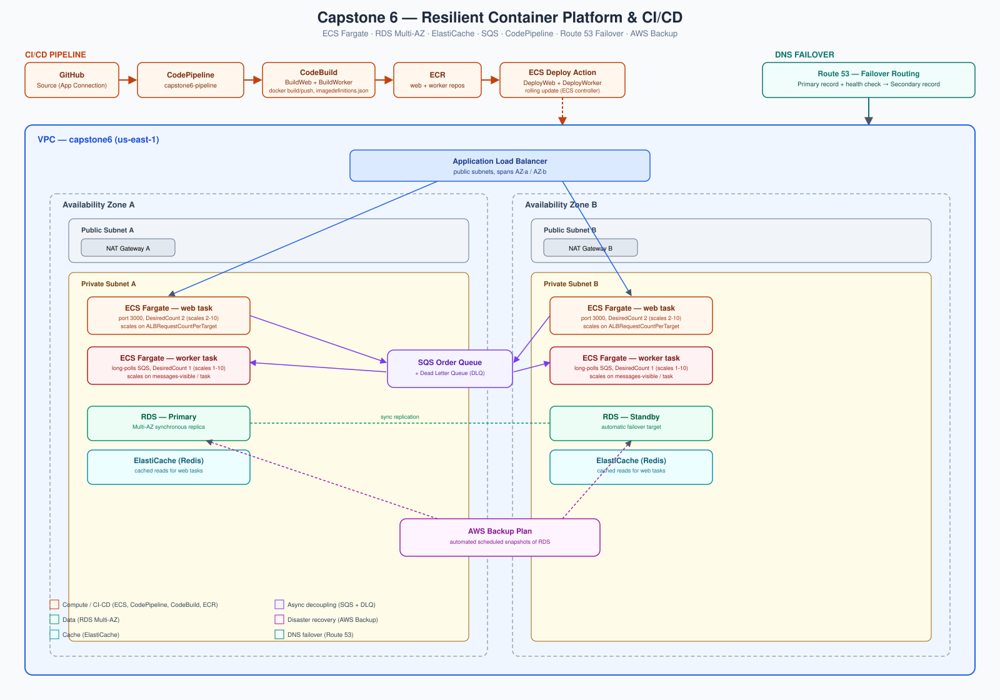

VPC across two AZs — public subnets host the ALB and NAT Gateways, private subnets host ECS (web + worker), RDS Multi-AZ, and ElastiCache. The web service publishes orders to SQS; the worker long-polls the queue and autoscales on queue depth per task. CodePipeline builds and deploys both services via CodeBuild → ECR → ECS rolling update. Route 53 health-checks the ALB and fails over to a secondary target if it goes unhealthy. AWS Backup takes scheduled RDS snapshots.

## Deployment order

All templates live in `infrastructure/` and are numbered in the order they must be deployed, because later stacks import outputs from earlier ones via `Fn::ImportValue`.

```bash
export ENV=capstone6
export REGION=us-east-1
export DB_PASSWORD='ChooseAStrongPassword123!'

# 1. Networking
aws cloudformation deploy \
  --template-file infrastructure/01-network.yaml \
  --stack-name ${ENV}-network \
  --parameter-overrides EnvName=$ENV \
  --region $REGION

# 2. Data layer (RDS Multi-AZ + ElastiCache) — takes ~10-15 min
aws cloudformation deploy \
  --template-file infrastructure/02-data.yaml \
  --stack-name ${ENV}-data \
  --parameter-overrides EnvName=$ENV DBPassword=$DB_PASSWORD \
  --capabilities CAPABILITY_IAM \
  --region $REGION

# 3. SQS queue + DLQ
aws cloudformation deploy \
  --template-file infrastructure/03-sqs.yaml \
  --stack-name ${ENV}-sqs \
  --parameter-overrides EnvName=$ENV \
  --region $REGION

# 4. ECS cluster, ALB, ECR repos
aws cloudformation deploy \
  --template-file infrastructure/04-ecs-cluster.yaml \
  --stack-name ${ENV}-ecs-cluster \
  --parameter-overrides EnvName=$ENV \
  --region $REGION

# --- Build & push initial images so the services have something to run ---
WEB_REPO=$(aws cloudformation describe-stacks --stack-name ${ENV}-ecs-cluster \
  --query "Stacks[0].Outputs[?OutputKey=='WebRepoUri'].OutputValue" --output text)
WORKER_REPO=$(aws cloudformation describe-stacks --stack-name ${ENV}-ecs-cluster \
  --query "Stacks[0].Outputs[?OutputKey=='WorkerRepoUri'].OutputValue" --output text)

aws ecr get-login-password --region $REGION | docker login --username AWS --password-stdin ${WEB_REPO%/*}

docker build -t $WEB_REPO:latest app/web && docker push $WEB_REPO:latest
docker build -t $WORKER_REPO:latest app/worker && docker push $WORKER_REPO:latest

# 5. ECS services (web + worker) with target-tracking auto scaling
aws cloudformation deploy \
  --template-file infrastructure/05-ecs-services.yaml \
  --stack-name ${ENV}-ecs-services \
  --parameter-overrides EnvName=$ENV WebImage=$WEB_REPO:latest WorkerImage=$WORKER_REPO:latest DBPassword=$DB_PASSWORD \
  --capabilities CAPABILITY_IAM \
  --region $REGION

# 6. AWS Backup plan
aws cloudformation deploy \
  --template-file infrastructure/06-backup.yaml \
  --stack-name ${ENV}-backup \
  --parameter-overrides EnvName=$ENV \
  --capabilities CAPABILITY_IAM \
  --region $REGION

# 7. Route 53 failover (needs a hosted zone you own)
aws cloudformation deploy \
  --template-file infrastructure/07-route53-failover.yaml \
  --stack-name ${ENV}-dns \
  --parameter-overrides EnvName=$ENV HostedZoneId=ZXXXXXXXXXXXX RecordName=shop.example.com \
  --region $REGION

# 8. CI/CD pipeline (needs a CodeStar Connections ARN to your GitHub repo,
#    created once via: aws codestar-connections create-connection --provider-type GitHub --connection-name capstone6)
aws cloudformation deploy \
  --template-file infrastructure/08-pipeline.yaml \
  --stack-name ${ENV}-pipeline \
  --parameter-overrides EnvName=$ENV GitHubOwner=<you> GitHubRepo=<repo> CodeStarConnectionArn=<arn> \
  --capabilities CAPABILITY_IAM \
  --region $REGION
```

## Evidence

### 1. Highly available infrastructure

| Evidence | What it shows |
|---|---|
| 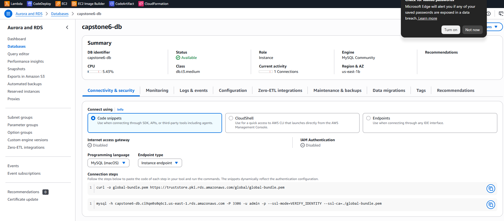 | RDS deployed Multi-AZ |
| 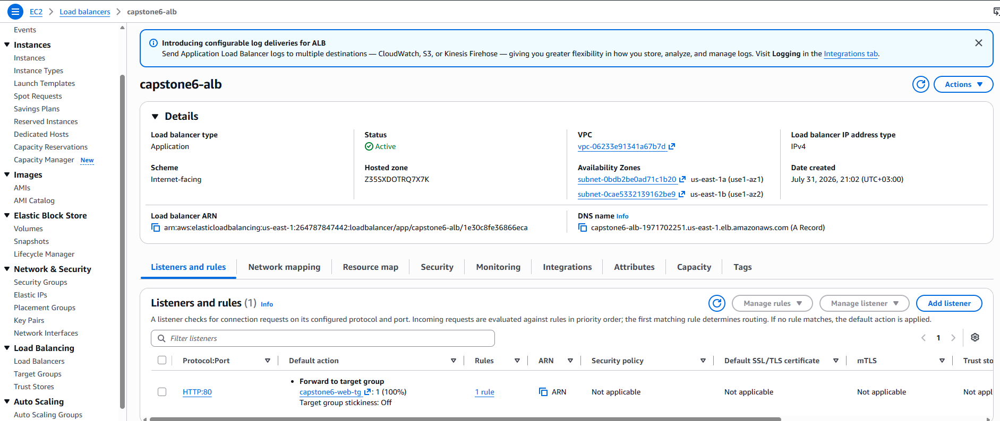 | Application Load Balancer spanning both AZs |
| 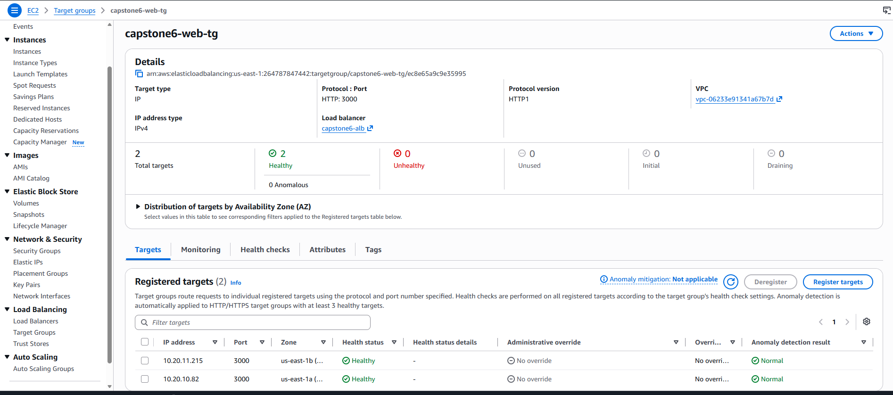 | ALB target groups with healthy targets in both AZs |
| 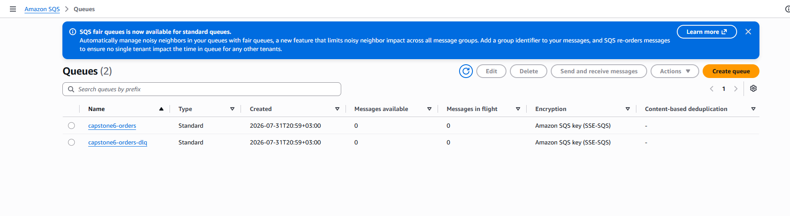 | SQS queue decoupling web → worker |
| 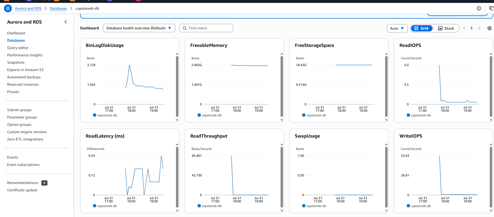 / 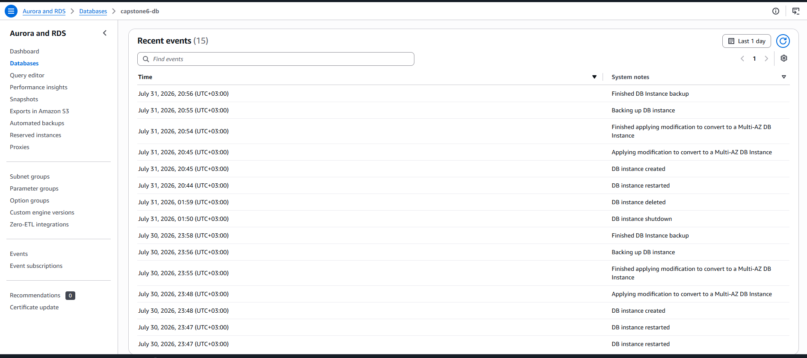 | RDS instance status and event history |

### 2. CI/CD pipeline & scaling

| Evidence | What it shows |
|---|---|
| 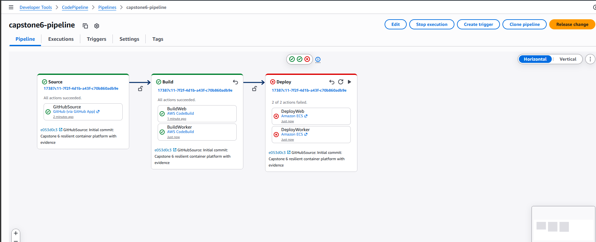 | CodePipeline: Source → Build → Deploy, all green |
| 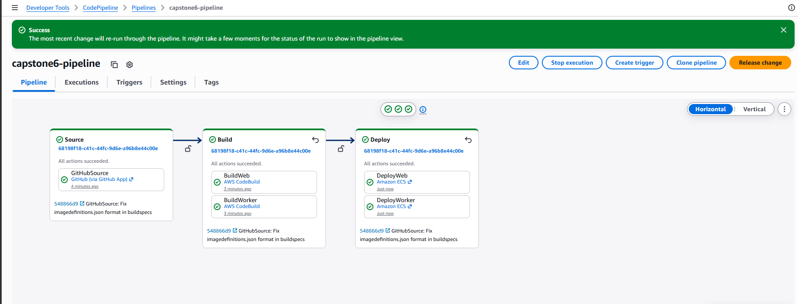 | CodeBuild stage detail (web + worker images) |
| 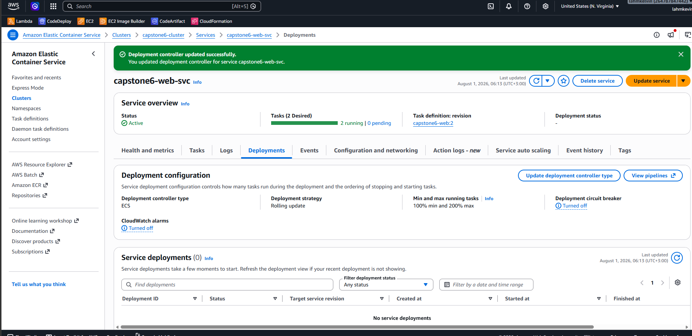 | ECS service updated with the newly built image |

Target-tracking auto scaling is configured in `infrastructure/05-ecs-services.yaml`:
- **Web service** scales 2–10 tasks on `ALBRequestCountPerTarget` (target: 500 req/target)
- **Worker service** scales 1–10 tasks on a custom metric (`ApproximateNumberOfMessagesVisible` ÷ `RunningTaskCount`, target: ~10 messages/task)

> Scaling-under-load proof (CloudWatch screenshot of task count or queue depth rising during a load test) — *not yet captured; infrastructure was torn down after functional testing to avoid ongoing AWS charges. To reproduce: redeploy per the steps above, then run the load generator below and screenshot the CloudWatch metric.*
> ```bash
> for i in {1..500}; do curl -s -X POST $ALB_DNS/orders -d '{"items":["x"]}' -H 'Content-Type: application/json' & done
> ```

### 3. Disaster recovery & failover

| Evidence | What it shows |
|---|---|
| 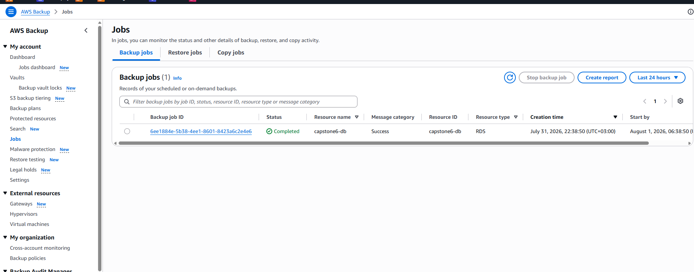 | AWS Backup plan with completed automated snapshot jobs |
| 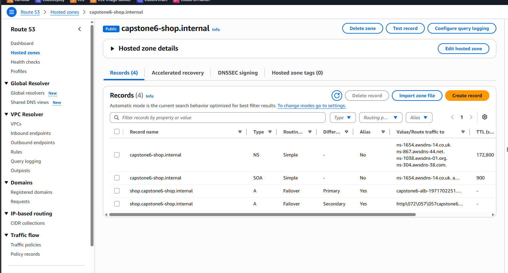 | Route 53 hosted zone configuration |
| 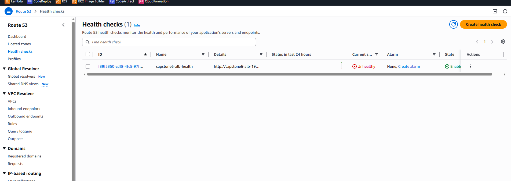 / 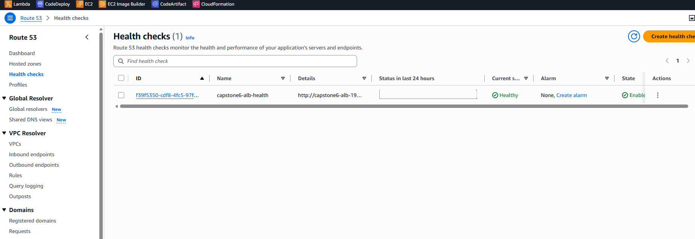 | Health checks driving primary/secondary failover routing |

## Notes / things to double check before submitting

- `05-ecs-services.yaml` and `08-pipeline.yaml` both import the ALB security group ID and listener ARN from `04-ecs-cluster.yaml`'s outputs (`${EnvName}-alb-sg-id`, `${EnvName}-alb-listener-arn`) — so stack 4 must be deployed before stacks 5 and 8.
- Secrets (`DBPassword`) are passed as CloudFormation parameters here for simplicity; for production/graded rigor, move them to AWS Secrets Manager and reference via `secrets:` in the task definition instead of plaintext `environment:`.
- Route 53 hosted-zone alias `HostedZoneId` values in `07-route53-failover.yaml` are for `us-east-1`; update if deploying elsewhere.
- The `capstone6-pipeline` and `capstone6-backup` CloudFormation stacks are in `DELETE_FAILED` state (non-empty S3 artifact bucket / Backup vault blocked automatic deletion during teardown) — does not incur meaningful ongoing cost, but should be cleaned up (empty the bucket / clear recovery points, then retry delete) before considering the environment fully torn down.
